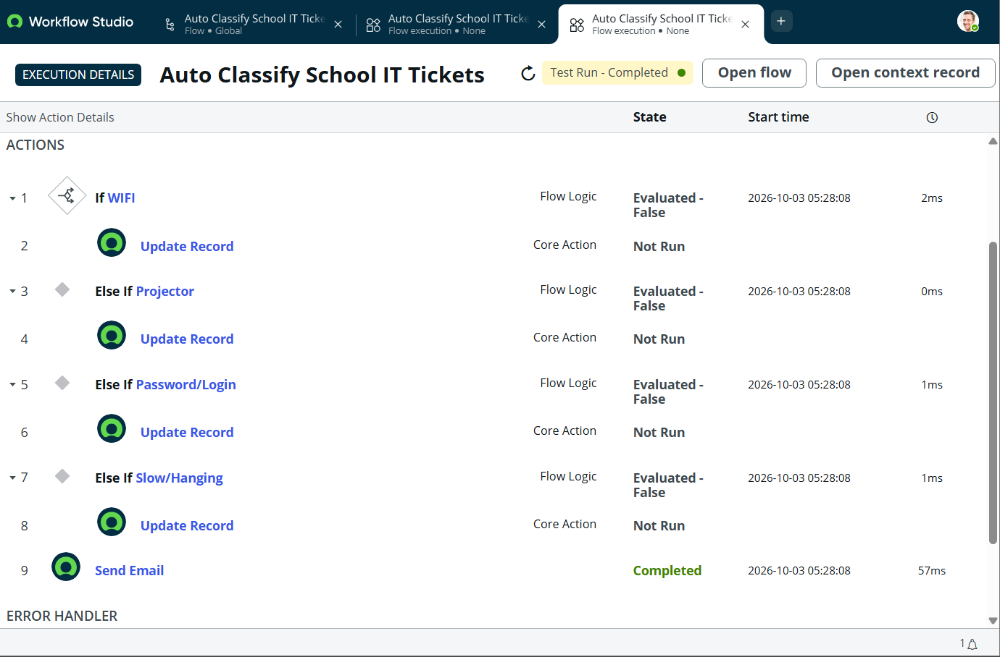
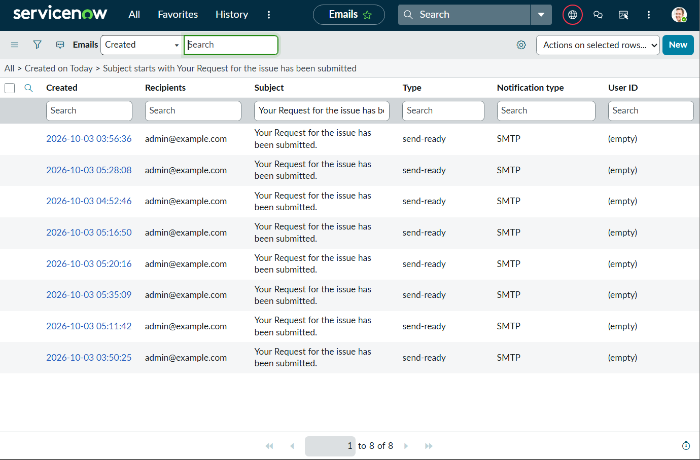
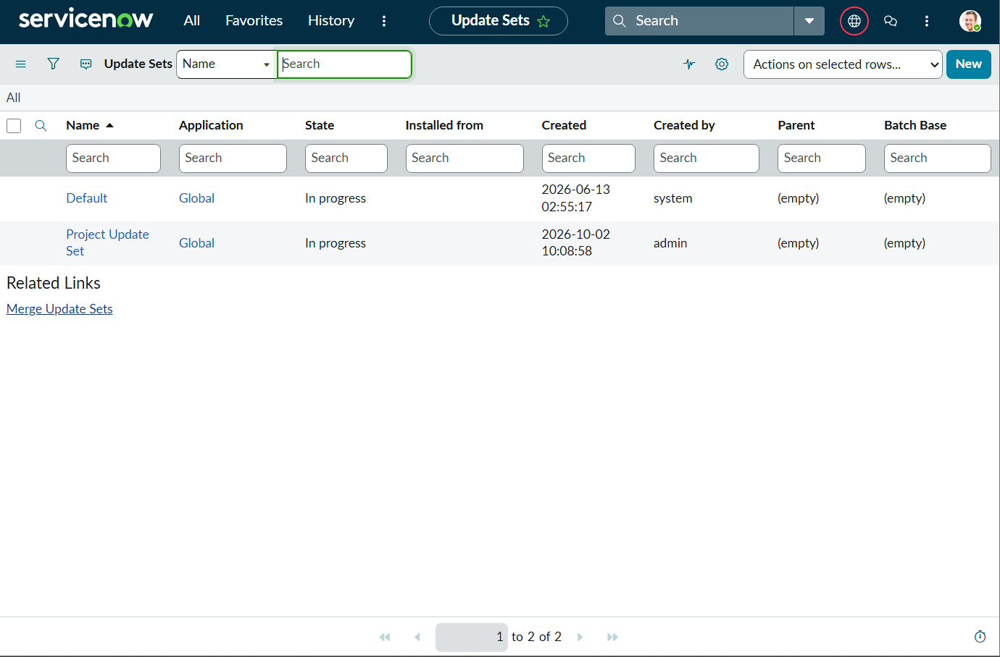

# Auto Ticket Classification using ServiceNow

## 📌 Project Overview
This project automates the classification of IT support tickets using **ServiceNow Flow Designer**.

The system analyzes the ticket's short description and automatically identifies the appropriate category and subcategory.

## 🚀 Features
- Automatic IT ticket classification
- Category and subcategory mapping
- Dependent subcategories
- Flow Designer automation
- Email notification to the caller
- Custom Incident Workflow table
- Automated ticket number generation

## 🛠️ Technologies Used
- ServiceNow
- Flow Designer
- JavaScript
- ServiceNow Tables & Fields
- Email Notifications

## 🔄 Classification Logic

| Issue Type | Category | Subcategory |
|---|---|---|
| WiFi | Network | Wi-Fi |
| Projector | Hardware | Projector |
| Password / Login | Access | Forgot Password |
| Slow / Hanging Computer | Performance | Slow Computer |

## 📂 Project File
The repository contains the exported **ServiceNow Update Set XML** used for deploying the project.

## 🎯 Objective
To reduce manual effort in IT ticket classification and improve the consistency and speed of ticket routing.

## 🎥 Project Demo

[Watch the ServiceNow Project Demo](serviceNow-project-demo.mp4)

## 📸 Project Screenshots

### 1. Incident Classification Results

### 2. Flow Execution

### 3. Email Notification Logs

## 👩‍💻 Author
**Dharmaram Saritha**
